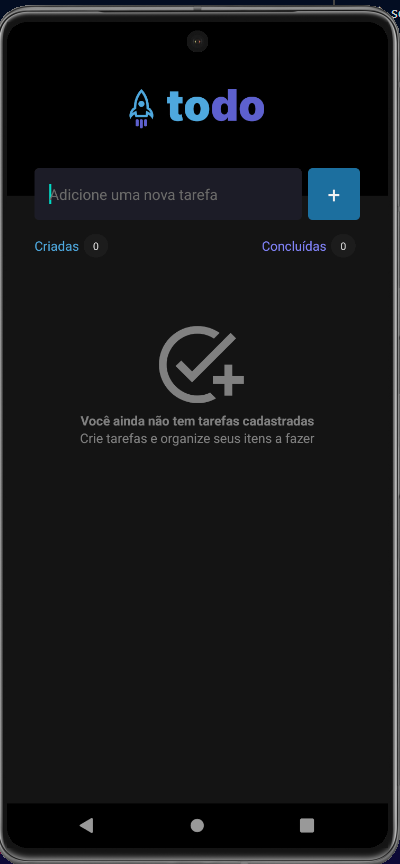
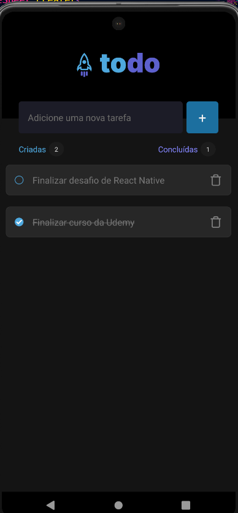

## Todo List with Expo

### how to run

`npm run start`

### screenshots and video:

`cd screenshots`

<video width="320" height="240" controls>
  <source src="./screenshots/example.mp4" type="video/mp4">
</video>
